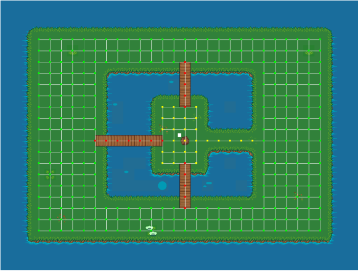

# Introductie
`libkmint` is een C++-bilbiotheek waarmee je de opdrachten voor het vak
kunstmatige intelligentie kan maken. Het staat je vrij om een andere bibliotheek
te gebruiken of zelf iets te schrijven zolang de bibliotheek van jouw keuze de
technieken die in dit vak worden behandeld niet al implementeert.

# Structuur van het project

Het project op Blackboard is onderverdeeld in een bibliotheek `libkmint` en
een applicatie `sim`. Daarnaast bevat de map `dependencies` de SDL2 en
SDL2_image bibliotheek voor Windows. Linux- en macOS-gebruikers moeten deze
bibliotheken via een /package manager/ installeren.

Je plaatst jouw eigen bronbestanden in de map `sim/src`. De code onder
`libkmint` laat je best ongemoeid. Mochten jij of een van je collega's
namelijk een fout ontdekken, dan krijgen jullie van ons een nieuwe versie
van `libkmint`. 

Als je een cpp-bestand toevoegt aan `sim/src` dan dien je ook
`sim/CMakeLists.txt` aan te passen. In dat bestand vind je nu onderstaande
code:

```cmake
add_executable(sim
    src/main.cpp)
```

Voeg je het bestand als `src/sim/hello_actor.cpp` toe, moet deze als volgt aan het project
worden gekoppeld:

```cmake
add_executable(sim
    src/sim/hello_actor.cpp # NIEUWE REGEL!
    src/main.cpp)
```

**Let op:** Headers moeten *niet* aan het project worden gekoppeld. Deze worden
indirect meegenomen via de `include`-directives.

## Compileren vanuit CLion
Het project kan onder Linux en macOS met CLion worden geopend en gecompileerd.
De combinatie van CLion en Windows is niet getest.

## Compileren vanuit Visual Studio
Visual Studio 2017 en 2019 ondersteunen CMake-projecten. Je kunt de map van het
hoofdproject openen. Visual Studio zal nu automatisch herkennen dat hier een
CMake-project in staat. Zorg ervoor dat je de eerste keer het gehele project
bouwt. Dan worden alle dependencies op de juiste plek geplaatst.

# Terminologie
`libkmint` gebruikt de volgende begrippen

- **stage** Een stage (/podium/) is de spelwereld waarop zich alle agenten
            bevinden. In de regel geldt dat alles wat beweegt, interageert
            met de wereld of getekend moet worden op het podium geplaatst
            moet worden.
- **actor** Een actor (/acteur/) staat op het podium. Je agenten (de koe en
            de haas) zijn actors. Daarnaast zijn zaken als de achtergrond van
            de speelwereld en de graaf ook actors. Actors hoeven dus niet
            dynamisch van aard te zijn.
- **drawable** Elke actor moet gekoppeld zijn aan een =drawable=. =drawable= is
            een basisklasse voor objecten die getekend worden op het scherm.
            Afgeleide klassen moeten de functie =draw= implementeren waarin
            getekend wordt.
- **graph** een graph representeert een graaf.
- **map** een map, oftewel kaart, is een combinatie van een graaf en een
  afbeelding die dient als achtergrond.
  
# Hello, world
Hieronder staat een simpel "hello world"-programma dat een venster opent en
wacht tot de gebruiker het venster sluit:

```cpp
#include "kmint/main.hpp"          // voor de main loop
#include "kmint/graphics.hpp"      // kleuren en afbeeldingen
#include "kmint/math/vector2d.hpp" // voor window en app
#include "kmint/play.hpp"          // voor stage
#include "kmint/ui.hpp"            // voor window en app

using namespace kmint; // alles van libkmint bevindt zich in deze namespace

int main() {
  // een app object is nodig om
  ui::app app{};

  //  maak een venster aan
  ui::window window{app.create_window({1024, 768}, "hello")};

  // maak een podium aan
  play::stage s{{1024, 768}};

  // Maak een event_source aan (hieruit kun je alle events halen, zoals
  // toetsaanslagen)
  ui::events::event_source event_source{};

  // main_loop stuurt alle actors aan.
  main_loop(s, window, [&](delta_time dt, loop_controls &ctl) {
    // gebruik dt om te kijken hoeveel tijd versterken is
    // sinds de vorige keer dat deze lambda werd aangeroepen
    // loop controls is een object met eigenschappen die je kunt gebruiken om de
    // main-loop aan te sturen.

    for (ui::events::event &e : event_source) {
      // event heeft een methjode handle_quit die controleert
      // of de gebruiker de applicatie wilt sluiten, en zo ja
      // de meegegeven functie (of lambda) aanroept om met het
      // bijbehorende quit_event
      //
      e.handle_quit([&ctl](ui::events::quit_event qe) { ctl.quit = true; });
    }
  });
}
```

# Een actor toevoegen
In deze paragraaf voegen we een actor toe aan de spelwereld. Een actor moet de
van de klasse `kmint::play::actor` overerven. In dit voorbeeld erven we over van
`free_roaming_actor`, een basisklasse voor actors die op een willekeurige
positie kunnen staan.

Om een actor te tekenen, moet je daarnaast een klasse maken die is afgeleid van
`kmint::ui::drawable`. Deze abstracte klasse bevat een methode `draw` die elk
frame wordt aangeroepen. Via de meegegeven `frame` referentie kun je tekenen.
Onderstaande code bevat de code voor een simpele `drawable` en een eerste
`actor`.

## De drawable
Voeg een bestand toe aan `sim/include/sim/rectangle_drawable.hpp` met daarin de
volgende code
```cpp
#ifndef _SIM_RECTANGLE_DRAWABLE_HPP
#define _SIM_RECTANGLE_DRAWABLE_HPP

#include "kmint/ui.hpp"

namespace kmint::play {
class actor; // forward declaration
}

namespace sim {

class rectangle_drawable : public kmint::ui::drawable {
public:
  rectangle_drawable(kmint::play::actor const &actor)
      : drawable{}, actor_{&actor} {}
  void draw(kmint::ui::frame &f) const override;

private:
  kmint::play::actor const *actor_;
};

} // namespace sim

#endif // _SIM_RECTANGLE_DRAWABLE_HPP
```

Plaats de implementatie van deze klasse in
`sim/src/sim/rectangle_drawabale.cpp`:
```cpp
#include "sim/rectangle_drawable.hpp"
#include "kmint/play.hpp"

namespace sim {
void rectangle_drawable::draw(kmint::ui::frame &f) const {
  f.draw_rectangle(actor_->location(), {10.0, 10.0},
                   kmint::graphics::colors::white);
}
} // namespace sim
```

## De actor
De definitie van je eigen `actor`-klasse plaats je in
`sim/include/sim/hello_actor.hpp`:

```cpp
#ifndef SIM_HELLO_ACTOR_HPP
#define SIM_HELLO_ACTOR_HPP

#include "kmint/play.hpp"
#include "sim/rectangle_drawable.hpp"

namespace sim {

class hello_actor : public kmint::play::free_roaming_actor {
public:
  hello_actor(kmint::math::vector2d location);
  kmint::ui::drawable const &drawable() const override;

private:
  rectangle_drawable drawable_;
};

} // namespace sim

#endif // SIM_HELLO_ACTOR_HPP
```

De member functions worden geïmplementeerd in het bestand
`sim/src/sim/hello_actor.cpp`. De constructor van `hello_actor` geeft de
initiële locatie door aan de constructor van basisklasse en roept tevens de
constructor aan van `drawable_`. 

```cpp
#include "sim/hello_actor.hpp"

namespace sim {

hello_actor::hello_actor(kmint::math::vector2d location)
    : free_roaming_actor{location}, drawable_{*this} {}

kmint::ui::drawable const &hello_actor::drawable() const { return drawable_; }

} // namespace sim
```

## `CMakeLists.txt` updaten

Voeg de bronbestanden `rectangle_drawable.cpp` en `hello_actor.cpp` toe aan
`CMakeLists.txt`:

```cmake
add_executable(sim
  src/sim/rectangle_drawable.cpp
  src/sim/hello_actor.cpp
  src/main.cpp)
```

## `main` updaten
Om een `actor` op het podium te plaatsen, roep je de template function
`build_actor` van `stage` aan. Mogelijk heb je nog nooit met template functions
gewerkt. Templates in C++ gedragen zich als generics in C# en Java. Je kunt
deze templates typeparameters tussen vishaken meegeven. 

Na het aanmaken van de `s` roep je de template member functie als volgt aan:
```cpp
sim::hello_actor &my_actor = s.build_actor<sim::hello_actor>(math::vector2d{512, 384});
```
Tussen vishaken staat de klassenaam van de actor die je wilt toevoegen. Tussen
de ronde haken geef je de parameters mee die je normaliter aan de constructor
van je klasse zou meegeven. Voor `hello_actor` is dit een `vector2d` die de
initiële positie van de actor aangeeft.

De functie geeft een referentie terug naar de nieuw aangemaakte `hello_actor`.
Deze referentie is geldig tot je `stage` wordt opgeruimd of tot je de member
functie `remove` van de actor aanroept. Dit zou je zo kunnen doen (**Voeg deze
regel niet toe aan je programma**):

```lang
my_actor.remove();
```

## Uitvoeren
Compileer het programma en voer deze uit. Als het goed is zie je nu een wit
vierkantje in het midden van het venster.

# Interactie
We gaan nu de mogelijkheid toevoegen om onze actor te bewegen met behulp van de
pijltjestoetjes. Voeg hiertoe onderstaande methode toe aan `hello_actor`

```cpp
void move(math::vector2d delta);
```

Geef deze de volgende implementatie
```cpp
void hello_actor::move(math::vector2d delta) {
  location(location() + delta);
}
```

Pas nu ook de `for`-lus aan in `main_loop`:

```cpp
for (ui::events::event &e : event_source) {
  // event heeft een methode handle_quit die controleert
  // of de gebruiker de applicatie wilt sluiten, en zo ja
  // de meegegeven functie (of lambda) aanroept om met het
  // bijbehorende quit_event
  //
  e.handle_quit([&ctl](ui::events::quit_event qe) { ctl.quit = true; });
  e.handle_key_up([&my_actor](ui::events::key_event k) {
    switch (k.key) {
    case ui::events::key::up:
      my_actor.move({0, -5.0f});
      break;
    case ui::events::key::down:
      my_actor.move({0, 5.0f});
      break;
    case ui::events::key::left:
      my_actor.move({-5.0f, 0});
      break;
    case ui::events::key::right:
      my_actor.move({5.0f, 0});
      break;
    default:
      break;
    }
  });
}
```

`handle_key_up` is een functie van `event` waarmee je aangeeft hoe je een
eventuele toetsindruk wilt afhandelen. Deze functie verwacht een lambdafunctie.
In tegenstelling tot in C# moet je aangeven welke variabelen je binnen je lambda
wilt gebruiken. Dit doe je tussen blokhaken. Daar staat nu `&my_actor` dat
aangeeft dat je `my_actor` binnen je lambda naar hetzelfde object moet verwijzen
als buiten de lambda. Als je de ampersand (het `&`-teken) weglaat, wordt er een
kopie van `my_actor` aangemaakt. In je lambda kun je dan alleen met dat kopie
werken.

# Een kaart toevoegen

Een kaart is een combinatie van een graaf met een achtergrondafbeelding. Een
kaart is een tweedimensionaal grid van vakjes. Een deel van deze vakjes zijn
verbonden met hun linker-, rechter-, boven- en/of onderbuur. Zo vormen deze
vakjes samen een graaf.
  
Een kaart wordt ingelezen uit een string. Hieronder zie je een voorbeeld,
verderop wordt per regel uitgelegd waar deze voor staat.
```{.numberLines}
40 6 32
resources/map3.png
G 1 1
C 1 2
W 0 0
B 1 8

GGGGGGGGGGGGGGGGGGGGGGGGGGGGGGGGGGGGGGGG
GGGGGGGGGGGGGGGGGGGGGGGGGGGGGGGGGGGGGGGG
GGGGGGGGGGGGGGGGGGGGGGGGGGCCCCCGGGGGGGGG
GGGGGGGGGGGGGGGGGGGGGGGGGGCCCCCGGGGGGGGG
GGGGGGGGGGGGGGGGGGGGGGGGGGCCCCCGGGGGGGGG
WWWWWWWWWBWWWWWWWWWWWWGGGGGGGGGGGGGGGGGG
```

- **1** De afmetingen van de kaart. Deze kaart is 40 vakjes breed, 6 vakjes
  hoog en elk vakje is 32 bij 32 pixels groot
- **2** Het pad naar de achtergrondafbeelding
- **3 t/m 6** Een beschrijving van de vakjes. Elk vakje heeft een symbool (`G`,
  `C`, `W` of `B`). Dit symbool wordt gevolgd door een 0 of een 1 die aangeeft
  of het vakje begaanbaar is. Een 0 betekent niet begaanbaar, een 1 betekent
  begaanbaar. Het laatste getal geeft hoe moeilijk het is om over dit vakje te
  bewegen. Het kost twee maal zoveel tijd om een vakje met een
  moeilijkheidsgraad van 2 te verlaten.
- **7** Een witregel die de informatie over de kaart scheidt van de echte kaart,
  let op: als je de kaart gekopieerd hebt uit de opdracht, dat deze witregel ook
  echt in je code staat!
- **8 t/m 13** Een beschrijving van de kaart. Elke regel correspondeert met een
  rij op de kaart, elk symbool met een vakje.
  
## Een kaart inlezen
Om een kaart te kunnen inlezen in je programma is het noodzakelijk om de
volgende header te includen

```cpp
#include "kmint/map/map.hpp"
```

De definitie van een kaart kun je in een bestand plaatsen of direct in je
programma. Onderstaande code laat zien hoe je met behulp van een *raw string
literal*[^1]. Voeg deze regels voor je `main` functie toe:

```cpp
static const char *map_description = R"graph(32 24 32
resources/firstmap.png
G 1 1
I 1 2
C 1 2
H 1 1
W 0 0
B 1 8

WWWWWWWWWWWWWWWWWWWWWWWWWWWWWWWW
WWWWWWWWWWWWWWWWWWWWWWWWWWWWWWWW
WWWWWWWWWWWWWWWWWWWWWWWWWWWWWWWW
WWWHGGGGGGGGGGGGGGGGGGGGGGGGHWWW
WWWGGGGGGGGGGGGGGGGGGGGGGGGGGWWW
WWWGGGGGGGGGGGGGBGGGGGGGGGGGGWWW
WWWGGGGGGWWWWWWWBWWWWWWGGGGGGWWW
WWWGGGGGGWWWWWWWBWWWWWWGGGGGGWWW
WWWGGGGGGWWWWWWWBWWWWWWGGGGGGWWW
WWWGGGGGGWWWWWIIBIWWWWWGGGGGGWWW
WWWGGGGGGWWWWWIIIIWWWWWGGGGGGWWW
WWWGGGGGGWWWWWIIIIWWWWWGGGGGGWWW
WWWGGGGGBBBBBBBICIIIIIIGGGGGGWWW
WWWGGGGGGWWWWWIIIIWWWWWGGGGGGWWW
WWWGGGGGGWWWWWIIBIWWWWWGGGGGGWWW
WWWGGGGGGWWWWWWWBWWWWWWGGGGGGWWW
WWWGGGGGGWWWWWWWBWWWWWWGGGGGGWWW
WWWGGGGGGWWWWWWWBWWWWWWGGGGGGWWW
WWWGGGGGGGGGGGGGBGGGGGGGGGGGGWWW
WWWGGGGGGGGGGGGGGGGGGGGGGGGGGWWW
WWWHGGGGGGGGGGGGGGGGGGGGGGGGHWWW
WWWWWWWWWWWWWWWWWWWWWWWWWWWWWWWW
WWWWWWWWWWWWWWWWWWWWWWWWWWWWWWWW
WWWWWWWWWWWWWWWWWWWWWWWWWWWWWWWW
)graph";
```

Plaats in je `main`-functie onderstaande code om de kaart uit te lezen:

```cpp
map::map m{map::read_map(map_description)};
```

De afbeelding en de graaf moeten elk onafhankelijk worden
getekend. Hiervoor gebruik je twee verschillende soorten actors. Een
`map_actor` tekent de graaf die hoort bij de kaart, en een `background`
tekent de achtergrond. Zorg ervoor dat je eerst de background aan je stage
toevoegt, gevolgd door de graaf. Daarna kun je andere actors toevoegen. Let erop
dat je deze **voor** je eigen `hello_actor` toevoegt. Actors worden namelijk
getekend in de volgorde waarin ze zijn aangemaakt.

```cpp
  s.build_actor<play::background>(
    math::size(1024, 768),
    graphics::image{m.background_image()});
  s.build_actor<play::map_actor>(
    math::vector2d{0.0f, 0.0f},
    m.graph());
```

Als het goed is, zie je nu het volgende op je scherm. De knopen van de graaf
krijgen een donkerdere rodere naar gelang het gewicht van de aanliggende kanten
toeneemt.




[^1]: Zie [dit voorbeeld op cppreference.com](https://en.cppreference.com/w/cpp/language/string_literal)

## De structuur van een kaart

Een `map` bestaat uit twee delen, een graaf van het type `map_graph` en het
pad naar een achtergrondafbeelding. De graaf haal je op via de functie
`map::graph()`. Deze graaf kun je zien als een array van knopen van het
type `map_node`. Het aantal knopen in een kaart kun je opvragen met de
functie `map_graph::num_nodes()`. De nodes kun je ophalen met de subscript
operator, bijvoorbeeld zo:
```cpp
  // laad een kaart
  map::map m{map::read_map(map_description)};
  auto &graph = m.graph();
  for (std::size_t i = 0; i < graph.num_nodes(); ++i) {
    std::cout << "Knoop op: " << graph[i].location().x() << ", "
              << graph[i].location().y() << "\n";
  }
```

Een knoop kun je op zijn beurt weer zien als een array van kanten van het
type `map_edge`. Het aantal kanten aan een knoop vraag je op met
`map_node::num_edges` en met de subscript operator kun je een van de kanten opvragen:

```cpp
auto &node = graph[0];
for (std::size_t i = 0; i < node.num_edges(); ++i) {
  auto &from = node[i].from();
  auto &to = node[i].to();
  std::cout << "Kant van: " << from.location().x() << ", "
            << from.location().y() << " naar " << to.location().x() << ", "
            << to.location().y() << "\n";
}
```

Elke kant heeft een gewicht. Dit geeft aan hoe lastig het is voor een actor
om zich via die kant te verplaatsen. De kanten horende bij de brug hebben
een gewicht van acht. Je kunt het gewicht ophalen met de functie `weight`:
```cpp
auto &node = graph[0];
auto &edge = node[0];
float weight = edge.weight();
```

*Voor gevorderden:* Wil je deze klassen gebruiken in combinatie met
STL-algoritmen dan kan dat. `map_graph` en `map_node` bieden member
functions `begin` en `end` die de juiste iterators teruggeven.

# Een actor op de graaf
Een volgende stap is om een actor te laten bewegen over de graaf.


## De koe
Actors die zich over de graaf bewegen zijn afgeleid van de klasse `map_actor`.
In de tekstuele beschrijving van de kaart is dit punt met de letter `C`
aangegeven. Dit is het vertrekpunt van de koe. Zij zal het eiland vanuit dit
punt over het eiland gaan dwalen. Maak nu het bestand `sim/include/sim/cow.hpp`
aan en plaats daarin onderstaande klasse: In het midden van de kaart zie je een
modderhoop.

```cpp
#ifndef SIM_COW_HPP
#define SIM_COW_HPP

#include "kmint/map/map.hpp"
#include "kmint/play.hpp"
#include "kmint/primitives.hpp"

namespace sim {

class cow : public kmint::play::map_bound_actor {
public:
  cow(kmint::map::map_node &initial_node);
  // wordt elke game tick aangeroepen
  void act(kmint::delta_time dt) override;
  kmint::ui::drawable const &drawable() const override { return drawable_; }
  // als incorporeal false is, doet de actor mee aan collision detection
  bool incorporeal() const override { return false; }
  // geeft de de lengte van een zijde van de collision box van deze actor terug.
  // Belangrijk voor collision detection
  kmint::scalar collision_range() const override { return 16.0; }

private:
  // hoeveel tijd is verstreken sinds de laatste beweging
  kmint::delta_time t_passed_{};
  // weet hoe de koe getekend moet worden
  kmint::play::image_drawable drawable_;
};

} // namespace sim

#endif
```
  
De meeste member functions van `cow` zijn dermate klein dat hun definities in de
header staan. 

De constructor en `act` functie plaatsen we wel in een apart `cpp`-bestand. Maak
nu het bestand `sim/src/sim/cow.cpp` aan en definieer de constructor als volgt:

```cpp
#include "sim/cow.hpp"
#include "kmint/random.hpp" // nodig om van willekeurige knoop naar willekeurige knoop te gaan

using namespace kmint;

namespace sim {

static const char *cow_image = "resources/cow.png";
cow::cow(map::map_node &initial_node)
    : play::map_bound_actor{initial_node}, drawable_{*this,
                                                     kmint::graphics::image{
                                                         cow_image, 0.1}} {}
} // namespace sim
```

De functie `act` wacht tot 1 seconde is gepasseerd en verplaats de koe daarna
naar een aangrenzende knoop:

```cpp
void cow::act(delta_time dt) {
  t_passed_ += dt;
  if (to_seconds(t_passed_) >= 1) {
    // pick random edge
    int next_index = random_int(0, node().num_edges());
    this->node(node()[next_index].to());
    t_passed_ = from_seconds(0);
  }
}
```

Vergeet tenslotte `src/sim/cow.cpp` niet toe te voegen aan `sim/CMakeLists.txt`

## De koe op het podium plaatsen
Om de koe te tonen, moet deze toegevoegd worden aan de stage. De koe begint
zoals gezegd op de plek die gemarkeerd is met een `C`. Je kunt deze functie
gebruiken om de index van de bijbehorende knoop te vinden:

```cpp
std::size_t find_cow_node(const map::map_graph &graph) {
  for (std::size_t i = 0; i < graph.num_nodes(); ++i) {
    if (graph[i].node_info().kind == 'C') {
      return i;
    }
  }
  throw "could not find starting point";
}
```

Je gebruikt deze informatie om de koe te creëren. Include eerst `sim/cow.hpp` in
`main.cpp`. Nu kun je een `cow` aanmaken. Doe dit in ieder geval pas na dat je
de `background` en `map_actor` hebt aangemaakt:

```cpp
auto &graph = m.graph();
auto cow_node_index = find_cow_node(graph);
sim::cow &cow = s.build_actor<sim::cow>(graph[cow_node_index]);
```

# Collision detection

Naast de koe bevindt zich ook een haas op de kaart. De koe moet deze haas
vangen. De haas bevindt zich op een van de vier uithoeken van de kaart, deze
zijn te herkennen aan de `H` in de tekstuele representatie.

De haas is een `map_bound_actor`. De header file voor de haas wordt
`include/sim/hare.hpp`:

```cpp
#ifndef SIM_HARE_HPP
#define SIM_HARE_HPP

#include "kmint/map/map.hpp"
#include "kmint/play.hpp"
#include "kmint/primitives.hpp"

namespace sim {

class cow;

class hare : public kmint::play::map_bound_actor {
public:
  hare(kmint::map::map_graph &g);
  void act(kmint::delta_time dt) override;
  kmint::ui::drawable const &drawable() const override { return drawable_; }
  void set_cow(cow const &c) { cow_ = &c; }
  bool incorporeal() const override { return false; }
  kmint::scalar collision_range() const override { return 16.0; }

private:
  kmint::play::image_drawable drawable_;
  kmint::map::map_graph *graph_;
  cow const *cow_{};
};

} // namespace sim

#endif // SIM_HARE_HPP
```

De haas begint op een van de met `H` aangegeven knopen en beweegt zich net als
de koe van een knoop naar een willekeurige aangrenzende knoop. Om te beginnen
definieer je een constructor die de haas op een van de mogelijke startplekken
plaats. Deze maakt gebruik van een functie `random_hare_node` die de index van
een willekeurige `H`-knoop teruggeeft. Voeg deze code toe aan een nieuw bestand
`sim/src/sim/hare.cpp`

```cpp
#include "sim/hare.hpp"
#include "kmint/random.hpp"
#include "sim/cow.hpp"
namespace sim {

using namespace kmint;

static const char *hare_image = "resources/hare.png";

std::size_t random_hare_node(map::map_graph const &graph) {
  int r = kmint::random_int(0, 3);
  for (std::size_t i = 0; i < graph.num_nodes(); ++i) {
    if (graph[i].node_info().kind == 'H') {
      if (r == 0)
        return i;
      else
        --r;
    }
  }
  throw "could not find node for hare";
}

} // namespace sim
```

Definieer de constructor onder de definitie van `random_hare_node`:
```cpp
hare::hare(map::map_graph &g)
    : play::map_bound_actor{g[random_hare_node(g)]},
      drawable_{*this, kmint::graphics::image{hare_image, 0.2}}, graph_{&g} {}
```

Nu definiëren we de member functie `act` die controlleert of de haas de koe
aanraakt. Is dat het geval, dan wordt de haas verplaatst naar één van de
startposities.
```cpp
void hare::act(kmint::delta_time dt) {
  for (std::size_t i = 0; i < num_colliding_actors(); ++i) {
    auto &a = colliding_actor(i);
    if (cow_ != nullptr && &a == cow_) {
      auto &g = *graph_;
      node(g[random_hare_node(g)]);
      return;
    }
  }
}
```

Voeg nu ook `src/sim/hare.cpp` toe aan `sim/CMakeLists.txt`.

Nu dat alles gereed is, kunnen we ook de haas aanmaken. Dit doen we na de koe.
Vervolgens geven we de haas een referentie naar de koe mee opdat deze kan
controlleren of de koe wordt aangeraakt. Include in `main.cpp` het bestand
`sim/hare.hpp` en voeg onderstaande regels toe.
```cpp
sim::hare &hare = s.build_actor<sim::hare>(graph);
hare.set_cow(cow);

```

# The end
Je hebt nu een werkend basisprogramma waarmee je aan de opdrachten voor week 1
kunt gaan werken. Succes!
